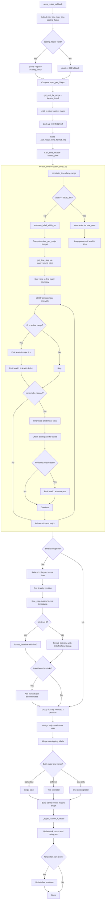

# axes_resize_callback Program Flow

```mermaid
flowchart TD
    A[axes_resize_callback] --> B[Extract min_time max_time scaling_factor]

    B --> C{scaling_factor valid?}
    C -- Yes --> D[pixels = span / scaling_factor]
    C -- No --> E[pixels = 800 fallback]
    D --> F[Compute span_per_100px]
    E --> F

    F --> G[get_unit_for_range - locator_time3]
    G --> H[unit0 = minor, unit1 = major]

    H --> I[Look up fmt0 fmt1 fmtf]

    I --> J[Store _last_resize_time_format_info]

    J --> K[Call _time_locator - locator_time]

    K --> LT

    subgraph LT [locator_time in locator_time3.py]
        direction TB
        LT1[constrain_time clamp range] --> LT2{unit0 == TIME_YR?}
        LT2 -- No --> LT3[estimate_label_width_px]
        LT3 --> LT4[Compute minor_per_major budget]
        LT4 --> LT5[get_time_step via lower_bound_step]
        LT5 --> LT6[floor_time to first major boundary]
        LT6 --> LT7[LOOP across major intervals]
        LT7 --> LT8{t1 in visible range?}
        LT8 -- Yes --> LT9[Emit level-0 major tick]
        LT9 --> LT10[Emit level-1 tick with dedup]
        LT8 -- No --> LT11[Skip]
        LT10 --> LT12{minor ticks needed?}
        LT11 --> LT12
        LT12 -- Yes --> LT13[Inner loop: emit minor ticks]
        LT13 --> LT14[Check pixel space for labels]
        LT14 --> LT15{Need first major label?}
        LT15 -- Yes --> LT16[Emit level-1 at minor pos]
        LT15 -- No --> LT17[Continue]
        LT16 --> LT17
        LT12 -- No --> LT18[Advance to next major]
        LT17 --> LT18
        LT18 --> LT7

        LT2 -- Yes --> LTY1[Year scale via nice_num]
        LTY1 --> LTY2[Loop years emit level-0 ticks]
    end

    LT --> M{time is collapsed?}

    M -- Yes --> N[Relabel collapsed to real time]
    N --> N1[Sort ticks by position]
    N1 --> N2[time_map.expand to real timestamp]
    N2 --> N3{tick level 0?}
    N3 -- Yes --> N4[format_datetime with fmt0]
    N3 -- No --> N5[format_datetime with fmt1/fmtf and dedup]

    N4 --> N6{inject boundary ticks?}
    N5 --> N6
    N6 -- Yes --> N7[Add ticks at gap discontinuities]
    N6 -- No --> O

    M -- No --> O
    N7 --> O

    O[Group ticks by rounded x position]
    O --> P[Assign major and minor slots]
    P --> Q[Merge overlapping labels]
    Q --> Q1{Both major and minor?}
    Q1 -- Same text --> Q2[Single label]
    Q1 -- Different --> Q3[Two line label]
    Q1 -- One only --> Q4[Use existing label]

    Q2 --> R
    Q3 --> R
    Q4 --> R

    R[Build labels coords majors arrays]
    R --> S[_apply_custom_x_labels]
    S --> T[Update tick counts and debug text]
    T --> U{horizontal_bars exist?}
    U -- Yes --> V[Update bar positions]
    U -- No --> W[Done]
    V --> W
```
